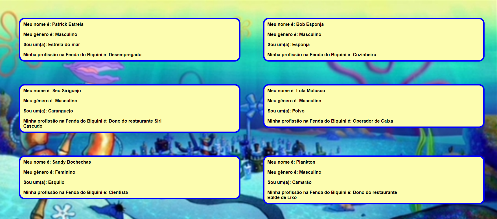

<h1 align="center"> Desafio-Bob Esponja </h1>

Desafio de consumir arquivo Json

  <a href="https://crystiancorrea.github.io/Desafio-Onfly/">Clique aqui</a> para acessar a tela do desafio

  

 

## 🚀 Tecnologias

Esse projeto foi desenvolvido com as seguintes tecnologias:

- HTML e CSS
- JavaScript
- Json

## 💻 Projeto

Desafio simples com o objetivo de criar um arquivo Json contendo os personagens de Bob Esponja e informar o nome, gênero, espécie e profissão de cada personagem, em seguida consumir esse Json usando alguma linguagem de programação (escolhi Javascript utilizando o método Fetch).

---

